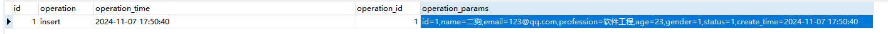
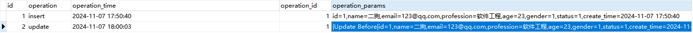
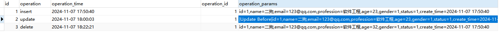
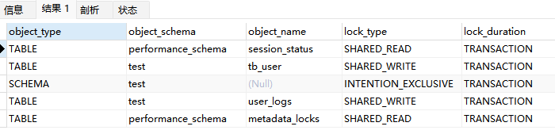
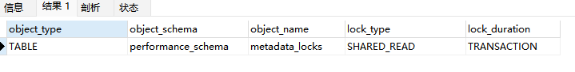
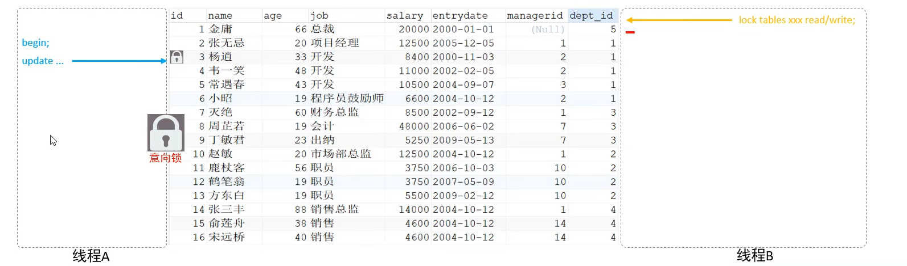
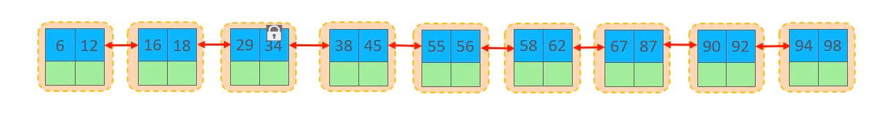
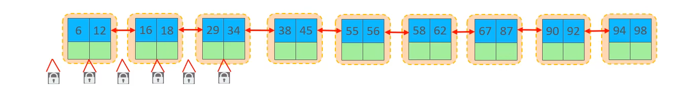
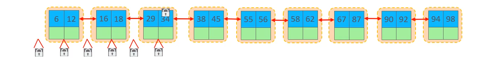

# Mysql

## 索引

### 聚簇索引和非聚簇索引

**聚簇索引指的是数据和索引存放在一起，非聚簇索引则反之**

innodb：既有聚簇索引也有非聚簇索引

myisam：非聚簇索引

### 回表

假设有一张表

| id   | name     | age  | gander |
| ---- | -------- | ---- | ------ |
| 主键 | 普通索引 |      |        |

那么在执行

```sql
select * from table where name = "张三	"
```

的时候会先在**name索引的B+树找到对应的主键**，**再使用主键去id的B+树查找整行的数据**。这个查询操作叫**回表**。

不推荐使用，效率降低

### 索引覆盖

假设有一张表

| id   | name     | age  | gander |
| ---- | -------- | ---- | ------ |
| 主键 | 普通索引 |      |        |

那么在执行

```sql
select id,name from table where name = "张三	"
```

**把要查询的字段都放在索引的叶子节点中，就可以解决对应的回表**

根据name的值到**name B+树**中获取对应叶子节点的数据，**叶子节点中包含了全部要查询的字段**，此时叫做**索引覆盖**

推荐使用，效率高

如果**extra字段**里面出现了**using index** 那么这个操作**就没有回表**

### 最左匹配

**就是最左优先，在创建多列索引时，要根据业务需求，where子句中使用最频繁的一列放在最左边。**

假设有一张表

| id   | name     | age      | gander |
| ---- | -------- | -------- | ------ |
| 主键 | 组合索引 | 组合索引 |        |

```sql
select * from where name = ? and age = ? (√)
select * from where name = ? (√)
select * from where age = ?
select * from where age = ? and name = ? (√)
```

**对号的查询中都是符合最左匹配的语句**

### explain

未加索引


加入了索引


## 集群

### 主从复制


在主从复制中出现的主要问题

网络延迟

复制延迟


这时候MTS来进行优化

#### MTS

**并行复制(MTS)**

MySQL 5.6基于库的并行复制出来后，基本无人问津，在沉寂了一段时间之后，MySQL 5.7出来了，它的并行复制以一种全新的姿态出现在了DBA面前。

**MySQL 5.7才可称为真正的并行复制**，这其中最为主要的原因就是**slave服务器的回放与master是一致的**，即**master服务器上是怎么并行执行**的，那么**slave上就怎样进行并行回放**。**不再有库的并行复制限制**，对于二进制日志格式也无特殊的要求（基于库的并行复制也没有要求）。

### 分库分表

在插入数据的时候尽量将数据分别部署在不同的库里面


#### 分片键

查询的时候尽可能多的带上分片键，根据分片键能够直接定位数据在哪个库里面

如果查询的时候没有分片键来进行定位的话，则会进行轮询查询，效率降低

## SQL优化

### 插入优化

使用批量插入

**关闭mysql自动提交，自己开启事务**

若数据超过一百万的话使用**load语句**来加载大数据的表

### 主键优化


**主键不要乱序插入排序**

### Update 优化

设有这样一张表

| id   | name  |
| ---- | ----- |
| 1    | java  |
| 2    | PHP   |
| 3    | Mysql |
| 4    | Kafka |

1.同时开启两个事务分别执行

```sql
begin;
update course set name = 'javaEE' where id = 1;
commit;
```

```sql
begin;
update course set name = 'Mongo' where id = 4;
commit;
```

此时发现可以提交，**此时Mysql加的是行锁**

2.再同时开启两个事务分别执行

```sql
begin;
update course set name = 'javaEE' where name = 'java';
commit;
```

```sql
begin;
update course set name = 'Mongo' where id = 4;
commit;
```

此时发现 第二个事务出现卡住的现象，**此时Mysql加的是表锁**

Mysql对于没有索引的字段，加的就是**表锁**

**update的时候一定要根据索引字段来进行更新**

### limit 优化

在**大数据量查询**的时候，数据**越往后查询效率越低**

比如要limit 2000000，10的时候，此时需要**排序前2000010记录**，仅仅返回2000000 - 2000010的记录，**其他记录丢弃**，查询排序的代价很大

- **通过覆盖查询 + 子查询的形式来进行优化**

- ```sql
  select id from tb_data order by id limit 9000000,10;
  ```

  先查询id，防止回表，再根据id来查询数据

  ```sql
  select * from tb_data where in (select id from tb_data order by id limit 9000000,10);
  ```

  注意版本不够高的会出现1235 - This version of MySQL doesn't yet support 'LIMIT & IN/ALL/ANY/SOME subquery'报错

  可以使用多表联查

  ```sql
  select a.* from tb_data a , (select id from tb_data order by limit 9000000,10) b where a.id = b.id;
  
  ```

## 视图

- **添加数据到视图中，就是添加到视图对应的基表里面**

### 视图的检查选项

**使用 with check option 子句创建视图时，可以限制插入的条件是否符合视图的规则**

为了确定检查的范围，mysql提供了两个选项:

- **cascaded**
- **local**

**默认值是cascaded**

#### cascaded

有两个视图

```sql
create or replace view note_vl_1 as select id,author_id,article_id from note where id <= 20;
```

```sql
create or replace view note_vl_2 as select id,author_id,article_id from note_vl_1 where id >= 10 with cascaded check option;
```

此时对note_vl_2进行插入

```sql
insert into note_vl_2 values(26,....);
```

发现插入不了，**cascaded作用是检查此视图和依赖的视图的规则是否满足**

#### local

**local是如果依赖的表有添加检查选项则检查，如果没有添加则跳过**

有两个视图

```sql
create or replace view note_vl_1 as select id,author_id,article_id from note where id <= 20;
```

```sql
create or replace view note_vl_2 as select id,author_id,article_id from note_vl_1 where id >= 10 with local check option;
```

此时对note_vl_2进行插入

```sql
insert into note_vl_2 values(26,....);
```

插入成功

## 触发器

### 触发器类型

| 触发器类型      | NEW和OLD                                               |
| --------------- | ------------------------------------------------------ |
| INSERT 型触发器 | NEW表示将要或者已经新增的数据                          |
| UPDATE 型触发器 | OLD表示修改之前的数据，NEW表示将要或者已经修改后的数据 |
| DELETE 型触发器 | OLD表示将要或者已经删除的数据                          |

**触发器现在还只支持行级触发**

#### Insert类型触发器

现在有tb_user和user_log两张表

一张为记录用户，一张记录用户操作日志的

user_log:

```sql
create table user_logs(
	id int(11) not null auto_increment,
	operation varchar(20) not null comment '操作类型, insert/update/delete',
	operation_time datetime not null comment '操作时间',
	operation_id int(11) not null comment '操作的ID',
	operation_params varchar(500) comment '操作参数',
	primary key(id)
)engine=innodb default charset=utf8;
```

现在创建一个trigger

```sql
-- 插入数据触发器
create trigger tb_user_insert_trigger after insert on tb_user for each row
begin
	insert into user_logs(id, operation, operation_time, operation_id, operation_params) VALUES
	(null, 'insert', now(), new.id, concat('id=',new.id,',name=',new.name,
	',email=',new.email,',profession=',new.profession,',age=',new.age,
	',gender=',new.gender,',status=',new.gender,',create_time=',new.create_time));
end;

-- 查看当前数据库的触发器
show triggers;

-- 插入数据到tb_user
insert into tb_user(id,name,email,profession,age,gender,status,create_time) values (1,'二狗','123@qq.com','软件工程',23,1,1,now());
```



#### Update 类型触发器

还是那两张表

现在创建Update trigger

```sql
create trigger tb_user_update_trigger after update on tb_user for each row
begin
	insert into user_logs(id, operation, operation_time, operation_id, operation_params) VALUES
	(null, 'update', now(), new.id, concat('Update Before|id=',old.id,',name=',old.name,
	',email=',old.email,',profession=',old.profession,',age=',old.age,
	',gender=',old.gender,',status=',old.gender,',create_time=',old.create_time,
	'Update After|id=',new.id,',name=',new.name,',email=',new.email,',profession=',new.profession,',age=',new.age,
	',gender=',new.gender,',status=',new.gender,',create_time=',new.create_time));
end;
```

**可以在设计表结构的时候设计完善版本控制问题，这里只做简单演示**



#### Delete 类型触发器

```sql
-- 删除数据的触发器
create trigger tb_user_delete_trigger after delete on tb_user for each row
begin
	insert into user_logs(id, operation, operation_time, operation_id, operation_params) VALUES
	(null, 'delete', now(), old.id, concat('id=',old.id,',name=',old.name,
	',email=',old.email,',profession=',old.profession,',age=',old.age,
	',gender=',old.gender,',status=',old.gender,',create_time=',old.create_time));
end;

-- 删除数据
delete from tb_user where id = 1;
```



## 锁

### 全局锁

其典型的使用场景为做全库逻辑备份，对所有表进行锁定，从而获取一致性视图，保证数据的完整性

```sql
flush tables with read lock;
```

使用mysqldump工具来进行全库备份

```sh
mysqldump -uroot -p1234 test_table > test_table.sql
```

备份完成解锁

```sql
unlock tables;
```

**注意**

在从库上备份的时候，备份期间不能执行主库同步过来的binlog，会导致**主从延迟**

**在InnoDB中，可以在备份的时候加上参数 --single-transaction 参数来完成不加锁的一致性数据备份**

```sh
mysqldump --single-transaction -uroot -p1234 test_table > test_table.sql
```

### 表级锁

主要分为三类

#### 表锁

##### 表共享读锁（read lock）

**只能读不能写**

```sql
lock tables test_table read;
```

释放：客户端断开连接或者语句

```sql
unlock tables;
```

##### 表独占写锁(write lock)

**其他客户端不能读写，自己可以**

```sql
lock tables test_table write;
```

释放方式一样

#### 元数据锁（meta data lock， MDL）

**MDL加锁过程是系统自动控制**，无需显示使用，在访问一张表的时候会加上。**MDL锁主要作用是维护表元数据的数据一致性，在表上有活动事务时候，不可以对元数据进行写入操作**。

元数据简单理解为数据的表结构，MDL的主要维护表结构，为了避免DML和DDL冲突，保证读写的正确性

- **在对一张表增删改查的时候，加MDL读锁(共享)；**

- **对表结构进行变更操作的时候，加MDL写锁(排他)**

| 对应SQL                                       | 锁类型                                  | 说明                                              |
| --------------------------------------------- | --------------------------------------- | ------------------------------------------------- |
| lock tables xxx read / write                  | SHARED_READ_ONLY / SHARED_NO_READ_WRITE |                                                   |
| select、select ... lock in share mode         | SHARED_READ                             | 与SHARED_READ、SHARED_WRITE兼容,与EXCLUSIVE 互斥  |
| insert、update、delete、select ... for update | SHARED_WRITE                            | 与SHARED_READ、SHARED_WRITE兼容，与EXCLUSIVE 互斥 |
| alter table ...                               | EXCLUSIVE                               | 与其他MDL都互斥                                   |

**场景一**

两个客户端同时开始事务，对表中进行查询和更新。此时什么问题都不会有，因为锁类型分别是SHARED_READ和SHARED_WRITE是兼容的。

```sql
begin;
select * from score;
commit;
```

```sql
begin;
update score set math=88 where id = 1
commit;
```

**场景二**

两个客户端同时开始事务,一个进行查询操作,一个进行对表结构的改变

```sql
begin;
select * from score;
commit;
```

```sql
begin;
alter table score add column java int;
commit;
```

**此时会发现,会有一个客户端产生阻塞的情况.一个锁的类型是EXCLUSIVE,一个是SHARED_RREAD.是互斥的**

当其中一个事务提交之后,另一个才会继续进行

**查看元数据锁:**

```sql
select object_type,object_schema,object_name,lock_type,lock_duration from performance_schema.metadata_locks;
```

记录了当前数据库实例中的元数据锁



提交事务之后



#### 意向锁

**场景:**

如果有一个客户端开启事务,并update表中的某一行数据的时候这个时候,加的是**行锁**

这个时候又来了一个客户端,要对这个表加表锁.这个时候要进行一行行的检查,检查表中是否有**行锁及行锁的类型,来判断是否能加锁成功**.

为了避免DML在执行的时候,加的**行锁与表锁的冲突**,**在InnoDB中引入了意向锁**,使得**表锁不用检查每行数据是否加锁**,使用**意向锁来减少表锁的检查**

有了意向锁之后

一个客户端在加**行锁的时候同时会加上这个表加上意向锁**

另一个客户端来加表锁的时候,就不用一行行寻找,**直接看表的意向锁是否和自己的表锁冲突以此来判断能不能加锁**



意向锁分两类

- **意向共享锁(IS)**: select ... lock in share mode \ **与表锁共享锁(read) 兼容, 与表锁排他锁(write) 互斥**
- **意向排他锁(IX)**: insert,update,delete,select ... for update \ **与表锁都互斥. 意向锁之间不会互斥**

### 行级锁

主要应用在**InnoDB**中,MyISAM中不支持行级锁

InnoDB中的数据是**基于索引组织的**,**行锁是通过索引上的索引加锁实现的**.

**所以在上面介绍Update优化的时候,建议根据索引来查找**

#### 行锁(Record Lock)

锁定**单个记录的锁**,防止其他事务对此进行update和delete.在**RC,RR隔离级别**下都支持



#### 间隙锁(Gap Lock)

**锁定索引记录的间隙(不含记录)**,**确保索引记录间隙不变**,**防止其他事务在这个间隙进行insert**,产生幻读.

在**RR隔离级别**下都支持



**只锁间隙不锁记录,比如6和12之间的锁住,但是不锁6和12**

#### 临键锁(Next-Key Lock)

**行锁和间隙锁组合,同时锁住数据,并锁住前面的间隙Gap.**

在**RR隔离级别**下支持



锁住34这个记录,同时锁住它前面的所有间隙
