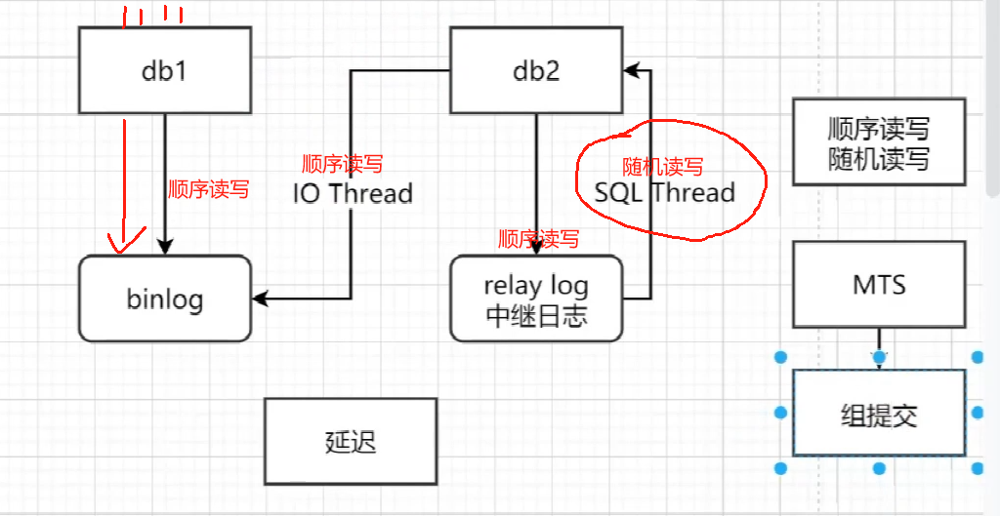

# Mysql

## 索引

### 聚簇索引和非聚簇索引

**聚簇索引指的是数据和索引存放在一起，非聚簇索引则反之**

innodb：既有聚簇索引也有非聚簇索引

myisam：非聚簇索引

### 回表

假设有一张表

| id   | name     | age  | gander |
| ---- | -------- | ---- | ------ |
| 主键 | 普通索引 |      |        |

那么在执行

```sql
select * from table where name = "张三	"
```

的时候会先在**name索引的B+树找到对应的主键**，**再使用主键去id的B+树查找整行的数据**。这个查询操作叫**回表**。

不推荐使用，效率降低

### 索引覆盖

假设有一张表

| id   | name     | age  | gander |
| ---- | -------- | ---- | ------ |
| 主键 | 普通索引 |      |        |

那么在执行

```sql
select id,name from table where name = "张三	"
```

**把要查询的字段都放在索引的叶子节点中，就可以解决对应的回表**

根据name的值到**name B+树**中获取对应叶子节点的数据，**叶子节点中包含了全部要查询的字段**，此时叫做**索引覆盖**

推荐使用，效率高

如果**extra字段**里面出现了**using index** 那么这个操作**就没有回表**

### 最左匹配

**就是最左优先，在创建多列索引时，要根据业务需求，where子句中使用最频繁的一列放在最左边。**

假设有一张表

| id   | name     | age      | gander |
| ---- | -------- | -------- | ------ |
| 主键 | 组合索引 | 组合索引 |        |

```sql
select * from where name = ? and age = ? (√)
select * from where name = ? (√)
select * from where age = ?
select * from where age = ? and name = ? (√)
```

**对号的查询中都是符合最左匹配的语句**

### explain

未加索引


加入了索引


## 集群

### 主从复制


在主从复制中出现的主要问题

网络延迟

复制延迟




这时候MTS来进行优化

#### MTS

**并行复制(MTS)**

MySQL 5.6基于库的并行复制出来后，基本无人问津，在沉寂了一段时间之后，MySQL 5.7出来了，它的并行复制以一种全新的姿态出现在了DBA面前。

**MySQL 5.7才可称为真正的并行复制**，这其中最为主要的原因就是**slave服务器的回放与master是一致的**，即**master服务器上是怎么并行执行**的，那么**slave上就怎样进行并行回放**。**不再有库的并行复制限制**，对于二进制日志格式也无特殊的要求（基于库的并行复制也没有要求）。

### 分库分表

在插入数据的时候尽量将数据分别部署在不同的库里面


#### 分片键

查询的时候尽可能多的带上分片键，根据分片键能够直接定位数据在哪个库里面

如果查询的时候没有分片键来进行定位的话，则会进行轮询查询，效率降低

## SQL优化

### 插入优化

使用批量插入

**关闭mysql自动提交，自己开启事务**

若数据超过一百万的话使用**load语句**来加载大数据的表

### 主键优化


**主键不要乱序插入排序**

### Update 优化

设有这样一张表

| id   | name  |
| ---- | ----- |
| 1    | java  |
| 2    | PHP   |
| 3    | Mysql |
| 4    | Kafka |

1.同时开启两个事务分别执行

```sql
begin;
update course set name = 'javaEE' where id = 1;
commit;
```

```sql
begin;
update course set name = 'Mongo' where id = 4;
commit;
```

此时发现可以提交，**此时Mysql加的是行锁**

2.再同时开启两个事务分别执行

```sql
begin;
update course set name = 'javaEE' where name = 'java';
commit;
```

```sql
begin;
update course set name = 'Mongo' where id = 4;
commit;
```

此时发现 第二个事务出现卡住的现象，**此时Mysql加的是表锁**

Mysql对于没有索引的字段，加的就是**表锁**

**update的时候一定要根据索引字段来进行更新**

### limit 优化

在**大数据量查询**的时候，数据**越往后查询效率越低**

比如要limit 2000000，10的时候，此时需要**排序前2000010记录**，仅仅返回2000000 - 2000010的记录，**其他记录丢弃**，查询排序的代价很大

- **通过覆盖查询 + 子查询的形式来进行优化**

- ```sql
  select id from tb_data order by id limit 9000000,10;
  ```

  先查询id，防止回表，再根据id来查询数据

  ```sql
  select * from tb_data where in (select id from tb_data order by id limit 9000000,10);
  ```

  注意版本不够高的会出现1235 - This version of MySQL doesn't yet support 'LIMIT & IN/ALL/ANY/SOME subquery'报错

  可以使用多表联查

  ```sql
  select a.* from tb_data a , (select id from tb_data order by limit 9000000,10) b where a.id = b.id;
  
  ```

## 视图

- **添加数据到视图中，就是添加到视图对应的基表里面**

### 视图的检查选项

**使用 with check option 子句创建视图时，可以限制插入的条件是否符合视图的规则**

为了确定检查的范围，mysql提供了两个选项:

- **cascaded**
- **local**

**默认值是cascaded**

#### cascaded

有两个视图

```sql
create or replace view note_vl_1 as select id,author_id,article_id from note where id <= 20;
```

```sql
create or replace view note_vl_2 as select id,author_id,article_id from note_vl_1 where id >= 10 with cascaded check option;
```

此时对note_vl_2进行插入

```sql
insert into note_vl_2 values(26,....);
```

发现插入不了，**cascaded作用是检查此视图和依赖的视图的规则是否满足**

#### local

**local是如果依赖的表有添加检查选项则检查，如果没有添加则跳过**

有两个视图

```sql
create or replace view note_vl_1 as select id,author_id,article_id from note where id <= 20;
```

```sql
create or replace view note_vl_2 as select id,author_id,article_id from note_vl_1 where id >= 10 with local check option;
```

此时对note_vl_2进行插入

```sql
insert into note_vl_2 values(26,....);
```

插入成功

## 触发器

### 触发器类型

| 触发器类型      | NEW和OLD                                               |
| --------------- | ------------------------------------------------------ |
| INSERT 型触发器 | NEW表示将要或者已经新增的数据                          |
| UPDATE 型触发器 | OLD表示修改之前的数据，NEW表示将要或者已经修改后的数据 |
| DELETE 型触发器 | OLD表示将要或者已经删除的数据                          |

**触发器现在还只支持行级触发**
