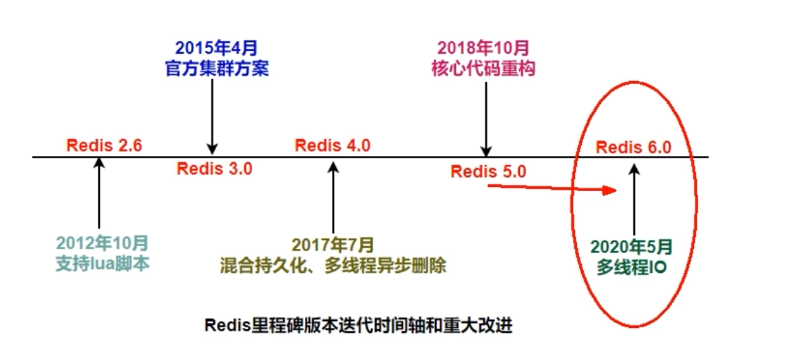
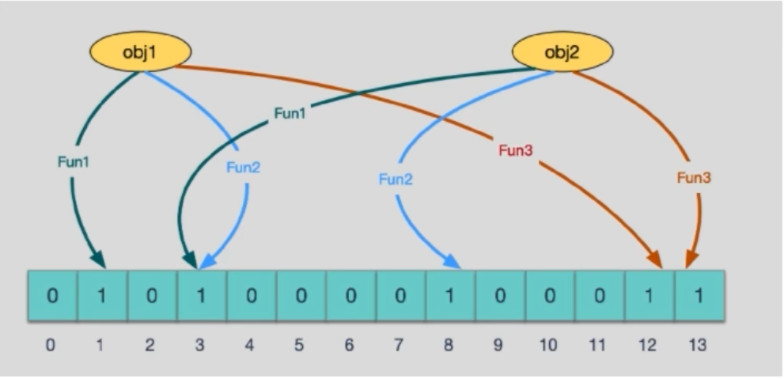
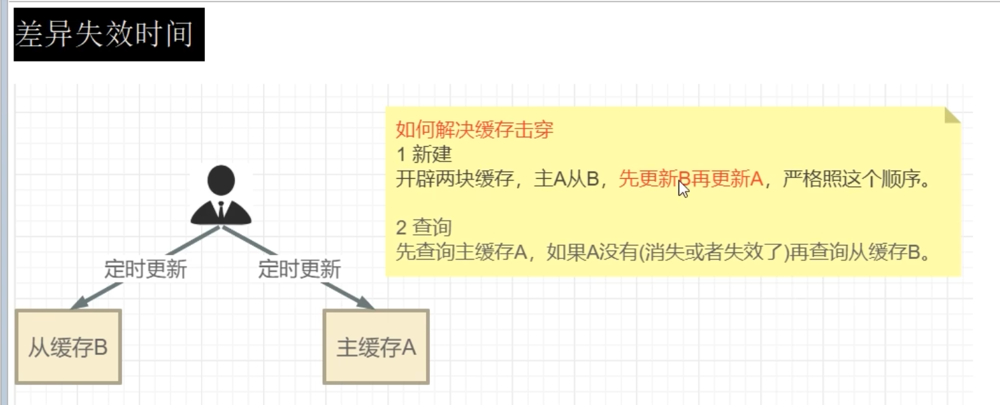
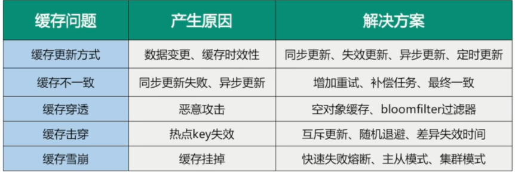

# Redis

## 单线程 IO多路复用



随着redis的版本迭代，为了性能的考虑。redis在**4.0**逐渐引入多线程

**为了迎合硬件的升级，CPU核心数的不断增多，Redis也逐渐引入多线程，提升性能**

而影响redis性能的也并不主要是CPU，而是**网络和内存**


### Redis 3.x单线程的主要问题

正常情况下**使用del来删除key的时候可以很快删除数据**，而当**key是一个非常大的对象**时候，例如包含了成千上万元素的hash集合 ，那么此时**del指令就会造成Redis卡顿**

如果更多的客户端进行大key操作，那么**性能就会极具下降**，宛如加锁操作

### Redis 4.x

**于是在Redis 4.0 中就新增了多线程的模块，主要是为了解决删除数据效率比较低的问题**

| **unlink key**                   |
| -------------------------------- |
| **flushdb async**                |
| **flushall async**               |
| 把删除工作交给了子线程异步来删除 |

### Redis 6/7

虽然有些命令可以用后台线程或子线程执行(比如数据删除，快照生成，AOF重写)。但是，从**网络IO处理到实际的读写命令出来**，都是由单个线程完成的。

**Redis的性能瓶颈有时会出现在网络IO处理上**，也就是说，单个主线程出来**网络请求的速度跟不上底层网络硬件的速度**

**到了Redis6/7 采用多个IO线程来处理网络请求，提高请求的处理和并行度**

**Redis的多IO线程只是用来处理网络请求的，对于读写操作还是使用单线程处理，毕竟主要的瓶颈在IO而不是CPU。也为了保障事务的原子性，Lua脚本，也不需要进行加锁操作**

## Big Key 问题

**场景：**

存入100万数据

使用pipe管道来进行命令装箱，速度快很多

```java
log.info("===========Redis Test================");
redisUtil.pipeline(connection -> {
    for(int i=1;i<100*10000;i++){
        redisUtil.setForever("key:"+i,"value"+i);
    }
    return null;
});
log.info("===========Redis Test Over================");
```

100万的数据插入完成之后 只用了15s

### key * 如何避免

**这时候如果要遍历所有的数据 使用key*的话会出现卡顿的现象**

那不用**key*避免卡顿**，那该用什么

#### **SCAN命令**

用于**迭代数据库中的数据库键**

类似于Mysql 的 limit

该命令和密切相关的命令 [`SSCAN、HSCAN`](https://redis.io/docs/latest/commands/sscan/) 和 [`ZSCAN`](https://redis.io/docs/latest/commands/zscan/) 用于逐步迭代元素集合。

- `SCAN`迭代当前所选 Redis 数据库中的键集。
- [`SSCAN`](https://redis.io/docs/latest/commands/sscan/) 迭代 Sets 类型的元素。
- [`HSCAN`](https://redis.io/docs/latest/commands/hscan/) 迭代 Hash 类型的字段及其关联值。
- [`ZSCAN`](https://redis.io/docs/latest/commands/zscan/) 迭代 Sorted Set（ZSet） 类型的元素及其相关分数。

语法如下

```
SCAN cursor [MATCH pattern] [COUNT cout]
```

**cursor - 游标**

**pattern - 匹配模式**

**count - 指定从数据库集里面返回多少元素，默认为 10**

基于游标的迭代器，需要基于上一次的游标延续之前的迭代过程

以0作为游标开始一次新的迭代，直到命令返回游标0完成一次遍历

**就是比如,scan 0 之后 返回的值如果是0，则代表完成了数据集的遍历**

```
> scan 0
1) "17"
2)  1) "key:12"
    2) "key:8"
    3) "key:4"
    4) "key:14"
    5) "key:16"
    6) "key:17"
    7) "key:15"
    8) "key:10"
    9) "key:3"
   10) "key:7"
   11) "key:1"
> scan 17
1) "0"
2) 1) "key:5"
   2) "key:18"
   3) "key:0"
   4) "key:2"
   5) "key:19"
   6) "key:13"
   7) "key:6"
   8) "key:9"
   9) "key:11"
```

**用户在下次迭代时候需要使用这个新游标来作为SCAN命令的游标参数**，以此来延续之前的迭代过程

#### SCAN的遍历顺序

它不是从第一位数组的第0位一直遍历到末尾的，而是采用了**高位进位加法来遍历**。**考虑到了字典的扩容和缩容时避免槽位的遍历重复和遗漏**

**缺点：**

**不保证每次执行都返回某个给定数量的元素，支持模糊查询，一次返回的数量不可控，只能是大概率符合count参数**


### 危险命令的禁用

**注意：**

在正式环境中要禁用掉redis的几个危险命令

- **keys** *
- **flushdb**
- **flushall**

这几个命令都可能发生严重的数据事故，**导致数据丢失，缓存雪崩，redis宕机**

通过配置设置**禁用**这些命令，**redis.conf在SECURITY这一项中**

```conf
rename-command keys ""
rename-command flushdb ""
rename-command flushall ""
```

将这些危险命令直接设为空，以达到禁用的效果

### Big key

大的内容不是key本身，而是它对应的value

#### 多大算Big

**string类型控制在10KB以内，hash，list，set，zset元素个数不要超过5000**

通过指令查找bigkey

追加参数 来查找

```sh
redis-cli ..... --bigkeys
```

使用MEMORY USAGE 来查找key和它的值在RAM中所占用的字节数

```
MEMORY USAGE key
```

#### 如何删除

**非字符串的bigkey，不要使用del删除，使用scan、hscan....渐进式删除。同时防止Bigkey的过期时间自动删除问题**

##### hash

使用hscan**每次获得少量field-value**，**再使用hdel删除每个field**

##### list

使用ltrim

##### Set

使用sscan + srem

##### SortedSet

使用zscan + zrem

#### Lazy Freeing

调整redis.conf配置文**LAZY FREEING**

##### 阻塞和非阻塞删除命令

```properties
lazyfree-lazy-server-del no -->> yes
replica-lazy-flush no -->> yes
lazyfree-lazy-user-del no -->> yes
```

## 缓存双写一致性问题

### 读写缓存

根据业务的不同选择不同的策略

#### 同步直写策略

指的是直接回写到redis，当数据库写入之后，**不开启异步线程**。**同步写入redis**

**当你的业务数据是热点敏感信息的时候就要使用**。比如：VIP充值

#### 异步缓写策略

指的是当数据库写入之后，**开启异步线程，或者发消息给MQ来异步写入redis**

**当你的业务数据不需要立即返回，不是热点信息的时候可以使用**

### 双检加锁策略

**防止在同一时间过多的请求打到Mysql，当过多的请求达到Mysql，也同时会过多的写入Redis**

```java
User user = redisTemplate.opsForValue().get(key);
if(user == null){
    synchronized(UserService.class){
        user = redisTemplate.opsForValue().get(key);
        if(user == null){
            user = userMapper.select(id);
            if(user == null){
                return null;
            }else{
                redisTemplate.opsForValue().set(key,user);
            }
        }
    }
}
return userl
```

## 大数据统计

### 常见术语

**PV**: （Page View）访问量, 即页面浏览量或点击量，衡量网站用户访问的网页数量；在一定统计周期内用户每打开或刷新一个页面就记录1次，多次打开或刷新同一页面则浏览量累计。
**UV**: （Unique Visitor）独立访客，客户端IP，统计1天内访问某站点的用户数。可以理解成访问某网站的电脑的数量。页面访问人数，同一个账号访问同一个页面两次，UV算1次
**DAU**： (Daily Active User)日活跃用户数量。常用于反映网站、互联网应用或网络游戏的运营情况。DAU通常统计一日（统计日）之内，登录或使用了某个产品的用户数（去除重复登录的用户），这与流量统计工具里的访客（UV）概念相似。
MAU： (monthly active users)月活跃用户人数。是在线游戏的一个用户数量统计名词，数量越大意味着玩这款游戏的人越多。
PCU： (Peak concurrent users )最高同时在线玩家人数。
KPI： 关键绩效指标法，是企业绩效考核的方法之一，其特点是考核指标 围绕关键成果领域进行选取。
ARPU： (Average Revenue Per User)即每用户平均收入，用于衡量电信运营商和互联网公司业务收入的指标。

### 常见的四种统计

- 聚合统计：共同好友、猜你喜欢。**指的是交集，并集，差集**
- 排序统计：评论区根据日期排序统计。**ZSET**
- 二值统计：钉钉中的签到打卡。指只存放true或false 1或0的统计。**bitmap**
- 基数统计：对UV的统计。**指存放指定不重复的key的数据**。**hyperloglog**

### hyperloglog / GEO / bitmap

#### Hyperloglog

Hyperloglog在输入元素的数量或者体积非常大的时候，计算基数所需的空间总是固定的，并且是很小的

在Redis里面，**每个hyperloglog键只需要花费12KB内存，就可以计算接近2^64个不同元素的基数**，这和计算基数时，元素越多耗费内存就越多的集合形成鲜明对比

通过牺牲准确率来换取空间，**对于不要求绝对准确率的场景下可以使用**，因为**概率算法不直接存储数据本身**，通过一定的概率统计方法预估基数值，同时保证误差在一定范围内，由于又不存储数据故此可以大大节约内存。**Hyperloglog就是一种概率算法的实现**

#### GEO

对于LBS，实时地理获取的场景可以使用**GEO**

- GEOHASH 返回坐标的geohash表示：geohash算法生成的base32编码值（三维变二维变一维）
- GEODIST 计算两个位置的距离
- **GEORADIUS** **输入坐标 以半径为中心，查找附近的元素**
- **GEORADIUSBYMEMBER** 于GEORADIUS效果一致，这个是**输入key值**

#### bitmap

**由0和1状态表现的二进制位的bit数组**

在签到统计时，每个用户一天的签到用1个bit位就能表示，一个月31个bit位，一年365个bit位

- SETBIT
- GETBIT
- BITCOUNT
- BITTOP 对不同的二进制存储数据进行位运算

## BloomFilter 布隆过滤器

场景：

- 现有50亿个电话号码，现有10万个电话号码，如何快速准确判断这些电话号码是否已经存在
- 黑白名单校验
- 查询布隆过滤器，挡掉大部分数据库中没有的数据，从而不用查询数据库，减缓数据库压力

**BloomFilter 是由一个初值都为0的bit数组和多个哈希函数构成，用来快速判断集合中是否存在某个元素**

可以高效地插入和查询，占用空间少，**但返回的结果是不确定性和不够完美的，因为会产生哈希冲突。哈希冲突的话会产生判断元素失误，如果判断一个元素存在，那这个元素不一定存在。但判断不存在时候，一定不存在**

**布隆过滤器可以添加元素，但是不能删除元素，涉及hashcode判断依据，删除元素会导致误判率增加**

 

如果这些点，有任何一个为0则被查询变量一定不存在

**因为映射函数本身就是散列函数，散列函数是会有碰撞的**

使用时最好不要让实际元素数量远大于初始化数量，一次给够避免扩容

当实际元素数量超过了初始化数量，应将重建布隆过滤器，再将原本的数据add到新的布隆过滤器中

## 缓存问题

### 缓存预热

将数据从数据库预先搬到redis中，给redis预热

- 利用redis回写机制
- 通过中间件或程序自行完成

### 缓存雪崩

发生

- redis主机挂了，Redis全盘崩溃 (硬件)
- redis中有大量key同时过期

解决

- 错开过期时间
- redis集群高可用
- 多缓存预防雪崩，可以加入本地缓存
- 服务降级

### 缓存穿透

redis里面没有数据，mysql也没有。**请求之后，请求还是打到了mysql**。redis宛如摆设，称之为缓存穿透

解决

- 布隆过滤器（推荐）
- 空对象缓存或缺省值（不推荐，因为当请求的key总是不同的话，redis也是形如摆设）

### 缓存击穿

**大量的请求同时查询一个key的时候，正好这个key正好失效了**，就会导致大量的请求打到数据库上面去

- **热点key突然失效**
- delete老的key，更新新的key。当还没更新完成的这段时间，高频请求打过来，就是缓存击穿

解决

- 不设置过期时间
- **多缓存，互斥更新，采用双检加锁策略**



### 总结



## Lua脚本

redis调用Lua脚本通过eval命令保证代码执行的原子性，直接用return返回脚本执行后的结果

**eval luascript numkeys [key [key ...]] [arg [arg ...]]**

### 场景

将set expire get 合为一个原子性操作

```lua
redis.call('set','k1','v1')
redis.call('expire','k1','30')
return redis.call('get','k1')
```

```lua
EVAL "redis.call('set','k1','v1') redis.call('expire','k1','30') return redis.call('get','k1')" 0
```

这样我们就将三条命令合为一个操作，保证了原子性

### 动态参数

```lua
EVAL "return redis.call('mset','k1','v1','k2','v2')" 0
```

执行完成，get正常

```lua
EVAL "return redis.call('mset','KEYS[1]','ARGV[1]','KEYS[2]','ARGV[2]')" 2 k1 k2 v1 v2
```

2指定了KEYS的数量 而剩下的都是ARGV

以参数的形式传入

## Redis分布式锁 & Redlock算法

场景问腿

- 当redis主从模式下，当客户端发送消息给了主机，当主机还未能将数据同步给从机，主机挂了。从机变成了主机，但是刚刚的数据却丢失了。
- 如何实现分布式锁，是否使用setnx命令实现，这是最合适的吗？如何考虑分布式锁的可重入问题。
- redis分布式锁如何续期？看门狗是否了解

为何需要redis分布式锁。在单机的JVM虚拟机内，传统的java实现的锁是可以的，**但是在分布式中不同JVM中资源互相独立**，锁不管用了。

一个合格的分布式锁要满足以下几个条件

- 独占性
- **高可用**
- 防死锁
- **不乱抢** （当A未完成操作，却到了锁的过期时间，这时候B来创建锁进行操作。当B操作到一半的时候，A操作完成然后把B刚刚创建的锁del了，这时候就出现问题了）
- **重入性** （保证同一个节点的同一个线程获得锁后，它可以再次获得这个锁）

### 分布式锁的解决方案

#### 问题1

用**递归**来进行监听锁的话**可能会出现堆栈溢出问题**

用**if**来进行判断redis锁的话可能导致**JUC中的虚假唤醒**

因此应该换成**while循环来进行监听redis锁**

#### 问题2

**加锁原子性问题**

在给redis加锁的时候

**加锁和设置过期时间是两个操作，并不是原子性的**。可能会出现问题

可以使用**redistemplate的setIfAbsent()方法来进行避免此问题**将两个操作和为一个

#### 问题3

**误删key问题**

```java
while(!redistemplate.opsForValue().setIfAbsent(key,uuidValue,30L,TimeUtil.SECONDS)){
	//重试枪锁
}
try{
	//业务
}catch(e){
    
}
finally{
    //删除锁
    redistemplate.delete(key);
}

```

可能会出现当**业务执行时间长于锁的过期时间**，这样可能会导致**删除了别的线程的锁**

改进

```java
while(!redistemplate.opsForValue().setIfAbsent(key,uuidValue,30L,TimeUtil.SECONDS)){
	//重试枪锁
}
try{
	//业务
}catch(e){
    
}
finally{
    //删除锁
    //对唯一标识进行判断
 	if(redistemplate.opsForValue().get(key).equalsIgnoreCase(uuidValue)){    
    	redistemplate.delete(key);
    }
}
```

#### 问题4

**判断和del不是原子性操作**

使用lua脚本进行修改

```lua
if redis.call('get',KEYS[1]) == ARGV[1] then
    return redis.call('del',KEYS[1])
else
    return 0
end
```

```java
while(!redistemplate.opsForValue().setIfAbsent(key,uuidValue,30L,TimeUtil.SECONDS)){
	//重试枪锁
}
try{
	//业务
}catch(e){
    
}
finally{
    //删除锁
    //对唯一标识进行判断
 	String luaScript = "if redis.call('get',KEYS[1]) == ARGV[1] then return redis.call('del',KEYS[1]) else return 0 end";
    redistemplate.execute(new DefaultRedisScript(luaScript,Boolean.class),Arrays.asList(key),uuidValue);
}
```

#### 可重入锁 （递归锁）

问题

线程A调用方法A的时候要建立锁并取得锁，方法A业务中调用了方法B，方法B也要取得锁。但是方法A锁住了，这就是**不可重入**

一个线程持有锁之后，再次获得不会产生死锁，这就是**可重入性**

**在同一个线程在外层方法获取锁的时候，在进入线程的内层方法会自动获取锁(前提是锁的对象是同一个对象)，不会产生死锁**

- java中的synchronized

##### redis实现

###### 结构设计

利用hset结构来实现,当次数等于0的时候证明锁不是自己的，反之则证明是自己的锁，自增一次表示重入

| K(业务对象key) | K（线程号:UUID） | V(重入次数) |
| -------------- | ---------------- | ----------- |
| RedisKey       | t1:dad12515      | 2           |

###### 锁的原子性

使用lua来进行lock或unlock保证原子性

lock

```lua
if redis.call('exists',KEYS[1]) == 0 or redis.call('hexists',KEYS[1],ARGV[1]) == 1 then
	redis.call('hincrby',KEYS[1],ARGV[1],1)
	redis.call('expire',KEYS[1],ARGV[2])
	return 1
else
    return 0
end
```

unlock

```lua
if redis.call('hexists',KEYS[1],ARGV[1]) == 0 then
    return nil
elseif redis.call('hincrby',KEYS[1],ARGV[1],-1) == 0 then
	return redis.call('del',KEYS[1])
else
	return 0
end
```

##### java实现

**使用AQS编写锁的规范接口行为来进行我们的可重入锁的实现**

```java
package com.xs.assistant.redis.lock;

import com.xs.assistant.redis.util.RedisUtil;
import lombok.extern.slf4j.Slf4j;

import java.util.List;
import java.util.UUID;
import java.util.concurrent.TimeUnit;
import java.util.concurrent.locks.Condition;
import java.util.concurrent.locks.Lock;

/**
 * 分布式锁
 */
@Slf4j
public class RedisDistributedLock implements Lock {
    private final RedisUtil redisUtil;

    private final String lockName;
    private final String uuidValue;
    private final long expireTime;

    private static final String LOCK_SCRIPT = """
            if redis.call('exists', KEYS[1]) == 0 or redis.call('hexists', KEYS[1], ARGV[1]) == 1 then
                redis.call('hincrby', KEYS[1], ARGV[1], 1)
                redis.call('expire', KEYS[1], ARGV[2])
                return 1
            else
                return 0
            end
            """;

    private static final String UNLOCK_SCRIPT = """
            if redis.call('hexists', KEYS[1], ARGV[1]) == 0 then
                return nil
            else if redis.call('hincrby', KEYS[1], ARGV[1], -1) == 0 then
                return redis.call('del', KEYS[1])
            else
                return 0
            end
            """;

    public RedisDistributedLock(RedisUtil redisUtil, String lockName, long expireTime) {
        this.redisUtil = redisUtil;
        this.lockName = lockName;
        this.uuidValue = UUID.randomUUID() + ":" + Thread.currentThread().getId();
        this.expireTime = expireTime;
    }

    @Override
    public void lock() {
        tryLock();
    }

    /**
     * 锁中断
     */
    @Override
    public void lockInterruptibly() {

    }

    @Override
    public boolean tryLock() {
        return tryLock(-1L,TimeUnit.SECONDS);
    }

    @Override
    public boolean tryLock(long time, TimeUnit unit) {
        if(time == -1L){
            while (!redisUtil.scriptLua(LOCK_SCRIPT,Boolean.class, List.of(lockName),uuidValue,String.valueOf(expireTime))){
                try {
                    TimeUnit.MICROSECONDS.sleep(60);
                } catch (InterruptedException e) {
                    log.error(e.getMessage());
                }
            }
            return true;
        }
        return false;
    }

    @Override
    public void unlock() {
        Long flag = redisUtil.scriptLua(UNLOCK_SCRIPT, Long.class, List.of(lockName), uuidValue);
        if(flag == null){
            log.error("This lock doesn't exist");
        }
    }

    @Override
    public Condition newCondition() {
        return null;
    }
}
```

#### 自动续期

lua脚本

```lua
//判断是否还存在此锁，若存在则证明业务还未完成，应该续期
if redis.call('hexists',KEYS[1],ARGV[1]) == 1 then
    return redis.call('expire',KEYS[1],ARGV[1],ARGV[2])
else
    return 0
end
```

java

```java
private void renewExpire(){
    new Timer().schedule(new TimerTask() {
        @Override
        public void run() {
            if (redisUtil.scriptLua(REEXPIRE_SCRIPT, Boolean.class, List.of(lockName), uuidValue, String.valueOf(expireTime))) {
                renewExpire();
            }
        }
    },(this.expireTime * 1000) >> 1);
}
```

